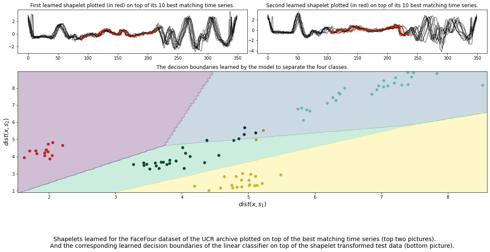

# Learning Time Series Shapelets

<p align="justify">
Shapelets are discriminative sub-sequences of time series that best predict the target variable. For this reason, shapelet discovery has recently attracted considerable interest within the time-series research community. Currently shapelets are found by evaluating the prediction qualities of numerous candidates extracted from the series segments. In contrast to the state-of-the-art, this paper proposes a novel perspective in terms of learning shapelets. A new mathematical formalization of the task via a classification objective function is proposed and a tailored stochastic gradient learning algorithm is applied. The proposed method enables learning nearto-optimal shapelets directly without the need to try out lots of candidates. Furthermore, our method can learn true top-K shapelets by capturing their interaction. Extensive experimentation demonstrates statistically significant improvement in terms of wins and ranks against 13 baselines over 28 time-series datasets.
</p>

<p align="center">
  
</p>

A PyTorch implementation of learning shapelets from the paper
> Josif Grabocka, Nicolas Schilling, Martin Wistuba, and Lars Schmidt-Thieme. 2014. Learning time-series shapelets. In Proceedings of the 20th ACM SIGKDD international conference on Knowledge discovery and data mining (KDD '14). Association for Computing Machinery, New York, NY, USA, 392–401.

*This implementation deviates from the paper by implementing multiple distance measures (euclidean distance, cross-correlation, and cosine similarity) and we use a hard-mininmum function compared to a soft-minimum in the paper.*

See the [paper](https://doi.org/10.1145/2623330.2623613) for a more detailed description.

## Shapelet Regularizer

When training with cross-entropy loss the learned shapelets might not resemble actual patterns of the dataset.
We performed experiments with an adapted loss function, introducing two regularizers to steer the learned shapelets to 
better resemble patterns of the data.
With the right strength for the regularizers we can consistently learn shapelets that well approximate
patterns of the dataset without loosing accuracy significantly.

We performed experiments on 85 of the [UCR archive](https://www.cs.ucr.edu/~eamonn/time_series_data_2018/). See [this notebook](experiment_results/experiment_results.ipynb)
for a description of the loss and for a presentation of the results.

This [demo](demo/demo_regularized_loss.ipynb) further demonstrates the regularized loss on one of the
UCR datasets.

A very similar idea was introduced in [this paper](https://arxiv.org/abs/2005.13948).

## How to use

```python
loss_func = nn.CrossEntropyLoss()
# Learning Shapelets as of the paper 'Learning Time Series Shapelets', Grabocka et al. (2014)
learning_shapelets = LearningShapelets(shapelets_size_and_len=shapelets_size_and_len,
                                       in_channels=n_channels,
                                       num_classes=num_classes,
                                       loss_func=loss_func,
                                       to_cuda=True,
                                       verbose=1,
                                       dist_measure=dist_measure)
# OR Learning Shapelets with regularized loss
learning_shapelets = LearningShapelets(shapelets_size_and_len=shapelets_size_and_len,
                                       in_channels=n_channels,
                                       num_classes=num_classes,
                                       loss_func=loss_func,
                                       to_cuda=True,
                                       verbose=1,
                                       dist_measure=dist_measure,
                                       l1=l1,
                                       l2=l2,
                                       k=k)

# (Optionally) Initialize shapelet weights, the original paper uses k-Means
# otherwise the shapelets will be initialized randomly.
# Note: This implementation does not provide an initialization strategy other
# than random initialization.
learning_shapelets.set_shapelet_weights(weights)

# Initialize an optimizer.
# Make sure to first set the weights otherwise the model parameters will have changed.
optimizer = optim.Adam(learning_shapelets.model.parameters(),
                       lr=lr,
                       weight_decay=wd)
learning_shapelets.set_optimizer(optimizer)

# Train model.
losses = learning_shapelets.fit(X_train,
                                y_train,
                                epochs=2000,
                                batch_size=256,
                                shuffle=False,
                                drop_last=False)

# Extract the learned shapelets.
shapelets = learning_shapelets.get_shapelets()

# Shapelet transform a dataset.
shapelet_transform = learning_shapelets.transform(X_test)

# Make predictions.
predictions = learning_shapelets.predict(X_test)
```

See the [demo](https://github.com/benibaeumle/Learning-Shapelets/blob/main/demo/demo.ipynb) for a detailed example.

### Parameters

```
--shapelets_size_and_len    dict(int, int)        The keys are the length of the shapelets
                                                  and the values the number of shapelets of
                                                  a given length, e.g. {40: 4, 80: 4} learns
                                                  4 shapelets of length 40 and 4 shapelets of
                                                  length 80.
--in_channels               int                   The number of channels of the time series.      Default: 1
--num_classes               int                   The number of output classes.                   Default: 2
--loss_func                 torch.nn              The loss function.
--dist_measure              'euclidean',          The distance measure to use to compute the      Default: 'euclidean'
                            'cross-correlation',  distances between the shapelets and the
                            or 'cosine'           the series.
--to_cuda                   bool                  Performs computations on GPU is true.           Default: True
                                                  Needs PyTorch with GPU support.
--verbose                   int                   Monitors training loss if set to 1.             Default: 0
--l1                        float                 Value for the regularizer L_dk.                 Default: 0.0
--l2                        float                 Value for the regularizer L_ss.                 Default: 0.0
--k                         int                   Value for top k parameter of regularizer L_dk   Default: 0
```

### Methods

* `fit(X, Y, epochs=1, batch_size=256, shuffle=False, drop_last=False)`: Learn time-series shapelets. If `shuffle` is true, the batches are shuffled after each epoch
  If `drop_last` is true, the last batch will be ignored if it is smaller than the batch size.
* `transform(X, Y)`: Perform shapelet transform
* `fit_transform(X, Y, epochs=1, batch_size=256, shuffle=False, drop_last=False)`: Perform `fit` followed by `transform`.
* `set_optimizer(optimizer)`: Set an optimizer for training.
* `set_shapelet_weights(weights)`: Initialize shapelets.
* `set_shapelet_weights_of_block(i, weights_block)`: Initialize the weights of a shapelet block, blocks are sorted ascending according to the length of the shapelets
* `update(x, y)`: Perform a single gradient update step with respect to batch (x, y).
* `update_regularized(x, y)`: Performs a single grdient update step with respect to batch (x, y) with the regularized loss function
* `predict(X)`: Classify X.
* `get_shapelets()`: Get the learned shapelets.
* `get_weights_linear_layer()`: Get the weights and biases of the logistic regression layer

## License

Released under MIT License. The code was developed by Benedikt Bäumle.

## Credits

The code was developed with the aid of the following libraries:

* [PyTorch](https://pytorch.org/)
* [NumPy](https://numpy.org/)
* [tqdm](https://github.com/tqdm/tqdm)
